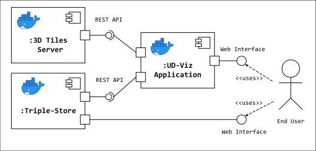

# UD-Demo-DocGraph

A web application for visualizing multimedia document and 3D city models using RDF semantic graphs:
* [UD-Viz](https://github.com/VCityTeam/UD-Viz) a frontend web application for urban data visualization
  * In particular the SPARQL and Workspace modules from [UD-Viz](https://github.com/VCityTeam/UD-Viz) is used to visualize semantic urban data in the form of RDF
* [Blazegraph](https://blazegraph.com/) an RDF-Store for storing and serving semantic graph data with a SPARQL REST API


### Component Diagram


## Installation

The following sections detail how to setup the demo.

### Pre-requisites 

* [Install Docker](https://docs.docker.com/engine/install/)

### Component Setup
First, clone this repository
```bash
git clone https://github.com/VCityTeam/UD-Demo-DocGraph.git
cd UD-Demo-DocGraph
```

The following sections will describe how to configure this file for each component. 

### Build Images and run containers

Then build the Blazegraph docker image and run its container:
```
docker compose up
```

### Upload RDF-Store Dataset
To upload the graph datafile into Blazegraph run the following command:
```bash
curl -X POST --data-binary 'uri=https://raw.githubusercontent.com/VCityTeam/UD-Graph/master/Transformations/test-data/RDF/documents/GratteCiel_2018_remarkable.ttl' 'http://127.0.0.1:8001/blazegraph/sparql'
```

Now the UD-Viz demo is ready and can be accessed from [localhost:8000](http://localhost:8000)
The Blazegraph GUI can also be accessed from [localhost:8001](http://localhost:8001)

> [!NOTE]
> By default, the following ports are used by the following services:
> - 8000: `UD-Viz`
> - 8001: `Blazegraph`
>
> To change these, you must:
> 1. Update your [.env](./.env) file to use these ports
> 2. Make sure to set the `sparqlModule/url` port in the [ud-viz-context/assets/config/config.json file](./ud-viz-context/assets/config/config.json) to use the new value for the new Blazegraph port.
>    - This also may imply rebuilding the `udviz` container:
>      ```bash
>      docker compose stop udviz
>      docker compose build udviz
>      docker compose up udviz
>      ```
> 3. Use the new port when [uploading the dataset to Blazegraph](#upload-rdf-store-dataset)
